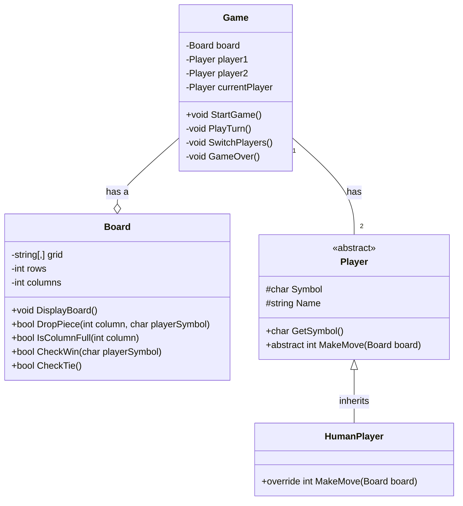

# Connect Four Game Design

---

## 1. Board Class

The `Board` class is responsible for managing the game grid and handling piece placements and win conditions.

### Attributes:

* `grid`: `string[,]` - A 2D array representing the game board. Each cell will store 'X', 'O', or an empty placeholder (e.g., " ").
* `rows`: `int` - The number of rows in the grid (e.g., 6 for Connect Four).
* `columns`: `int` - The number of columns in the grid (e.g., 7 for Connect Four).

### Methods:

* `DisplayBoard()`: Displays the current state of the game board to the console.
* `DropPiece(column, playerSymbol)`:
    * Attempts to drop `playerSymbol` into the specified `column`.
    * Returns `bool`: `true` if the piece was successfully dropped, `false` otherwise (e.g., if the column is full).
* `IsColumnFull(column)`:
    * Checks if the specified `column` has reached its maximum capacity.
    * Returns `bool`: `true` if the column is full, `false` otherwise.
* `CheckWin(playerSymbol)`:
    * Checks for a winning condition (four `playerSymbol`s in a row, column, or diagonal) on the board.
    * Returns `bool`: `true` if `playerSymbol` has won, `false` otherwise.
* `CheckTie()`:
    * Checks if the board is completely filled and no player has won.
    * Returns `bool`: `true` if the game is a tie, `false` otherwise.

### Visibility:

* **Private Attributes:** `grid`, `rows`, `columns` (with public getters if external access is required for information, but not direct modification).
* **Public Methods:** `DisplayBoard`, `DropPiece`, `IsColumnFull`, `CheckWin`, `CheckTie`.

---

## 2. Player (Abstract Class) and HumanPlayer (Concrete Class)

This design incorporates an abstract `Player` class to define a common interface for all player types, and a concrete `HumanPlayer` class for user-controlled play. @TODO `ComputerPlayer`

### Player (Abstract Class)

### Attributes:

* `Symbol`: `char` (e.g., 'X' or 'O'). This should be `protected` or `private` with a public getter.
* `Name`: `string` for game messages like "David Wins!".

### Methods:

* `abstract MakeMove(Board board)`: `int`
    * This is an **abstract method** that concrete player types (like `HumanPlayer`) will implement.
    * It will return the column number chosen by the player.
* `GetSymbol()`: `char`

### HumanPlayer (Concrete Class, inherits from Player)

### Attributes:

* Inherits `Symbol` and `Name` from the `Player` class.

### Methods:

* `override MakeMove(Board board)`: `int`
    * This method will prompt the user for a column number (typically 1-7).
    * It will include validation to ensure the chosen column is within bounds and not full, potentially calling `board.IsColumnFull()`.
    * It will return the validated column number.
@TODO COMPPLAYER
---

## 3. Game Class (Controller Class)

The `Game` class serves as the central controller, orchestrating the game flow, managing turns, and overseeing the overall game state.

### Attributes:

* `board`: `Board` - An instance of the `Board` class, representing the game board. This signifies a **composition relationship** where the `Game` "has a" `Board`.
* `player1`: `Player` - An instance of the abstract `Player` class, typically initialized with a `HumanPlayer` instance. This allows for future flexibility to substitute other `Player` types.
* `player2`: `Player` - Similar to `player1`, another instance of the abstract `Player` class.
* `currentPlayer`: `Player` - Stores the `Player` object whose turn it currently is. This provides a more object-oriented approach to turn management compared to using an `int`.

### Methods:

* `StartGame()`:
    * Contains the main game loop.
    * Initializes the `board`, `player1`, and `player2` objects.
    * Randomly determines which player goes first, or defaults to "X" (player1) starting.
    * Enters a loop that repeatedly calls `PlayTurn()` until a win or tie condition is met.
    * Calls `GameOver()` once the game loop concludes.
* `PlayTurn()`:
    * Manages the logic for a single turn.
    * Calls `board.DisplayBoard()` to show the current game state.
    * Indicates whose turn it is (`currentPlayer`).
    * Calls `currentPlayer.MakeMove(board)` to get the desired column from the active player.
    * Calls `board.DropPiece(column, currentPlayer.Symbol)` to place the piece on the board.
    * Checks for a win condition using `board.CheckWin(currentPlayer.Symbol)`.
    * Checks for a tie condition using `board.CheckTie()`.
    * Calls `SwitchPlayers()` to transfer control to the other player.
* `SwitchPlayers()`:
    * Toggles the `currentPlayer` attribute between `player1` and `player2`.
* `GameOver()`:
    * Displays the final outcome of the game (e.g., "Player X Wins!" or "It's a Tie!").
    * Prompts the users if they wish to play another round.

### Visibility:

* **Public Methods:** `StartGame` (if called from an external entry point like `Program.cs`).
* **Private Attributes:** `board`, `player1`, `player2`, `currentPlayer`.

---

